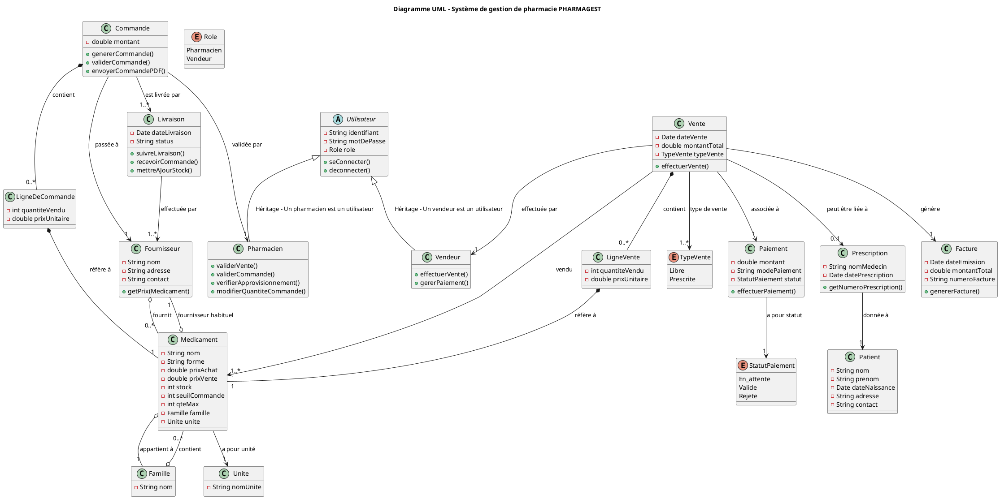
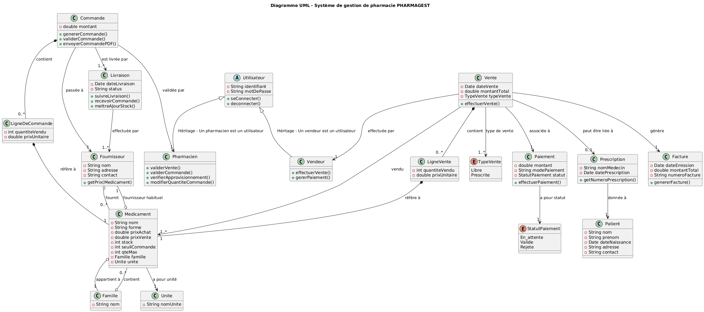

# pharmagest

Pharmagest est une application permettant de gérer l’approvisionnement par souci d’éviter les ruptures de stock et ainsi
améliorer les ventes de médicaments, la direction de la pharmacie a décidé
d’investir dans l’informatisation de sa gestion du stock.

## 📝 Diagramme UML

